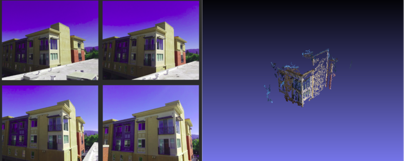

# cSfM

This is an early prototype project to develop a Structure from Motion Pipeline. 



## Requirements and Dependencies

This package uses the following 3rd party packages to run: 

1. [gtsam](https://bitbucket.org/gtborg/gtsam)
2. [PMVS2](https://www.di.ens.fr/pmvs/documentation.html)

You will need to go and install GTSAM on your own machine. I used [this tag](https://bitbucket.org/gtborg/gtsam/src/c82fe1fde2fc988b6bde5e4798b66129bbb5da19/?at=4.0.0-alpha2) when I did my testing. 

For PMVS2, I have included it in this local repo so It can make local calls to it to build the actual pointcloud `*.ply` file.

## How To Build

Once you have installed GTSAM, you will need to navigate to the root of this directory and run: 

```
mkdir build
cd build
cmake ..
make
```

You should see the `cSfM` executable now in the build directory. 

## Usage

To use cSfM, you will need to have a directory containing several images of your item of interest. You will also need to pass in the *FULL* path to a textfile that contains the name of the images in the same folder you wish to build the pointcloud of, the focal length of your image (in pixels), the center of your image in x and y.

If you are using a [claibrated camera](https://docs.opencv.org/2.4/doc/tutorials/calib3d/camera_calibration/camera_calibration.html), this should be easy to find as elements in the resultant distortion matrix. 

However, if you are using images from a smart phone/uncalibrated camera, you can estimate these parameters.

To calculate the focal length of your image, I have written a simple helper Python script. The way you use that is as follows: 

```
python calculate_focal_length.py [pxW] [f_mm] [fov]```

where: 

1. `pxW` is the width of the images in pixels.
2. `f_mm` is the focal length of the camera that was used to capture the image in [mm].
3. `fov` is the camera's Field of View in degrees. 

To get this information, one can look at the [EXIF](https://en.wikipedia.org/wiki/Exif) metadata that their images should have.


This should print out a relatively accurate estimate of the focal length of your images in pixel space.

For a rough estimate of the center of the image in x and y, you can use this rough estimate: 

1. cx = PixelWidth/2
2. cy = PixelHeight/2

This should be accruate enough, as the algorithm will attempt to calculate a more accurate camera matrix as it triangulates points in space.

## Assumptions and Caveats

This is still a first attempt at SfM, this is a very complex problem that still has a lot of research conducted on how to use different cameras and different improve results. That being said, here are some thoughts and tips to get good results: 

1. Scale down your images. This pipeline does not use a GPU based method to calculate poses in space via triangulation, so it may take a long time. 

2. Try and use images that have large overlaps in them. Right now the pipeline matches keypoints across all the images, so if there is not enough overlap, it will struggle to recover camera poses.

3. Use a few images at first to test things out. Do not overestimate how computationally expensive it becomes as the size of images and volume of the image stack increases.

## Future Improvements

I hope to continue to develop this further by adding the following improvements over time as a side project: 

1. Move away from AKAZE for feature matching and towards optical flow.
While working on this project I learned that although photojournalism uses unsorted SfM, most of my image sets were image sets from walking around with a camera to different points in space. This lends itself more to the Visual Odometry aspect of SfM as well as the applications of robotics and more traditional computer vision. 
Integrate this pipeline into ROS and use it with Visual Odometry. 

2. In the past I have started to write a [Monocular Visual Odometry ROS package](https://github.com/atomoclast/ros_mono_vo). With what I learned here, I would really like to go and see how I can improve my error prone implementation there with what I learned. See how I can integrate VO and SfM together.

3. Look further into OpenMVG, OpenMVS, and PCL. One issue with PMVS is that it produces a singular static ply file. If I wanted to integrate this into ROS for dynamic pointcloud pointcloud generation, I will need to figure out how to build up pointcloud data structures and publish them for the data types that ROS can handle.


## References

1. http://www.cse.psu.edu/~rtc12/CSE486/lecture19.pdf
2. https://docs.opencv.org/3.0-beta/modules/calib3d/doc/camera_calibration_and_3d_reconstruction.html
3. https://docs.opencv.org/3.1.0/da/de9/tutorial_py_epipolar_geometry.html
4. http://nghiaho.com/?p=2379
5. https://www.di.ens.fr/pmvs/pmvs-1/index.html
6. http://www.cs.cornell.edu/~snavely/bundler/
7. https://robotics.stackexchange.com/questions/14456/
determine-the-relative-camera-pose-given-two-rgb-camera-frames-in-opencv-python
8. https://www.cc.gatech.edu/grads/j/jdong37/files/gtsam-tutorial.pdf


